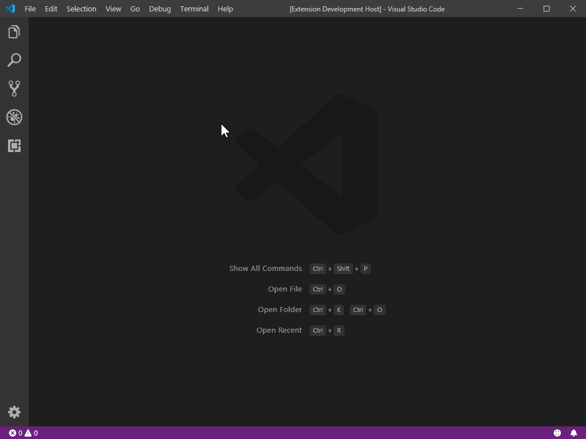

# Sandbox

Test your snippets of JavaScript, HTML, and CSS! 

Easily, instantly, and all within your familiar VS Code environment.

## Features

### Live Code Playground

Prototype, play, and experiment with your web development ideas. No setup required.

1. Create your sandbox with the command: 
   - `Sandbox: New Sandbox`

2. Start coding in the provided text editors. 
3. As you type, the results update in the live preview.

- Need to manually reload? VS Code has a command for us.
  -  `Developer: Reload Webviews`

- Want to debug something? VS Code has that built-in.
  - `Developer: Open Webview Developer Tools`  

### Save Your Work

In the Explorer view, you can use the "Download" context option to save files, or the sandbox itself as a folder.

### Additional Commands

`Sandbox: Reopen Editors`
  - Accidentally close an editor or move the editor grid around? You can restore the editors back to normal with this command.

`Sandbox: Close Sandbox`
  - The sandbox can be closed and removed from your workspace with this command.

## Known Issues

Using the VS Code provided _Webview Developer Tools_ has some quirks. The details are documented [here](https://code.visualstudio.com/api/extension-guides/webview#inspecting-and-debugging-webviews).
  - Elements: Your sandbox DOM is contained in the "active-frame" `iframe` element.
  - Console: To evaluate code in your sandbox, switch to the "active-frame" option using the top-left dropdown. It's set to "top" initially.
  - Sources: For convenience, the script with your JS code is mapped as `script.js` in the file tree and in the "Open file" selector.

In the Explorer view, using the "Download" context menu item on the workspace folder causes the Windows _File save_ dialog to open instead of a _Folder save_ dialog. 
  - This incorrectly saves the folder with a default ".txt" extension. 
  - The download still succeeds, but it will likely append the extension to the folder name.

## Release Notes

### 1.0.0

Initial release of Sandbox!

### 1.0.1

Change default styles to not conflict with user's `body` `background` styling.
 